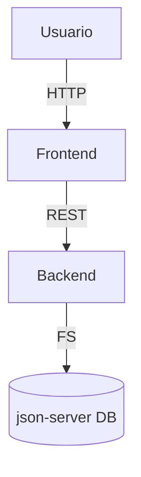

# Arquitectura de la Plataforma

La solución se compone de dos aplicaciones principales:

1. **Backend**: API REST construida con Node.js/Express e integrada con `json-server` para la persistencia de datos.
2. **Frontend**: Aplicación web generada con Vite (Vanilla JS) consumiendo las APIs del backend.

## Diagrama de Componentes (UML)

## Descripción General
- Los usuarios interactúan mediante la aplicación web (sitio público o plataforma interna según rol).
- El backend expone endpoints para recolección, inventario, pedidos y autenticación.
- `json-server` gestiona un archivo `db.json` con la información principal.

## Módulos Principales
- **Gestión de Recolección**: CRUD de entradas de teléfonos y rutas.
- **Desmantelamiento**: registro de partes reutilizables y chatarra.
- **Inventario**: stock y control de componentes.
- **Pedidos**: catálogo de componentes, carrito y seguimiento.
- **Usuarios**: autenticación (JWT simple) y roles.

